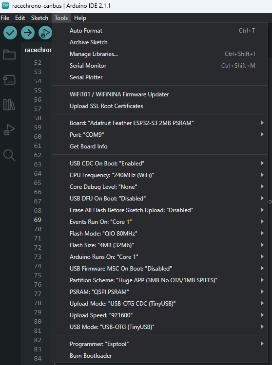

# Arduino Setup for ESP32

## Arduino Board Configuration for ESP32s3

Since the supported ESP32 boards are dual-core, it is important to run the Arduino core on core 1. The drivers are
written such that all the Bluetooth LE activity is handled on core 0 and all the CAN-bus activity is handled on core 1.



## Arduino for Visual Studio Code

Example using VSCode + Arduino extension with Adafruit Feather ESP32s3:

```json
{
    "configuration": "LoopCore=1,EventsCore=1,USBMode=default,CDCOnBoot=cdc,MSCOnBoot=default,DFUOnBoot=default,UploadMode=cdc,PSRAM=enabled,PartitionScheme=huge_app,CPUFreq=240,FlashMode=qio,FlashSize=4M,UploadSpeed=921600,DebugLevel=none,EraseFlash=none",
    "board": "esp32:esp32:adafruit_feather_esp32s3",
    "sketch": "racechrono-canbus.ino",
    "programmer": "esp32:esptool",
    "output": "./build"
}
```
